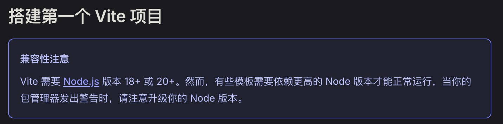
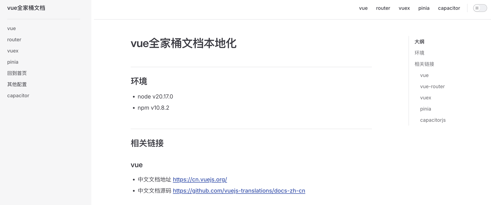

# vue 全家桶文档

在我们使用 vue 开发前端项目过程中，查阅文档是必不可少的过程。为了方便查阅，我将 vue 相关核心文档整理在一起。

通过此项目，我们可以随时随地查阅 vue3 相关文档。

## 目录说明

- `android`: Android APP 的源文件
- `docs`: vue3 离线文档
- `files`: 保存在项目周期内用到的一些资源
- `ios`: iOS APP 的源文件
- `notes`: 记录在此项目进行过程中的一些关键点

## 启动项目

我在操作此项目过程中使用的 node 版本为`20.17.0`。由于项目用到了`vitepress`，建议 node 版本为`18+`或者`20+`。

> 参考：[https://cn.vitejs.dev/guide/#scaffolding-your-first-vite-project](https://cn.vitejs.dev/guide/#scaffolding-your-first-vite-project)



### 将项目下载到本地

```bash
$ git clone https://github.com/dadaowuma/vue3doc.git

$ cd vue3doc

$ npm install
```

### 本地启动 vue 全家桶文档

离线文档位于 `docs` 目录中，该目录包含 vue、vuex、vue-router、pinia 文档。

```bash
$ npx http-server docs
# 或者
$ npm start # localhost:8080
```

### 本地启动操作手册

notes 目录中，记录了 vue 全家桶文档项目的完整操作过程。

包括各文档的构建过程，以及过程中的一些关键点。

```bash
$ npm run dev # localhost:5173
```



## APP 效果

### Android 端效果

<table>
  <tr>
    <td></td>
    <td></td>
    <td></td>
  </tr>
</table>

### iOS 端效果

<table>
  <tr>
    <td></td>
    <td></td>
    <td></td>
  </tr>
</table>

## 注意事项

### github pages 无法访问离线文档的问题

此仓库的`pages`地址为`https://dadaowuma.github.io/vue3doc/`，链接指向的是项目中的`docs`目录。

由于`docs`目录中的文档是以`docs`为根目录，离线文档位于`二级目录`，而 pages 中，离线文档为`三级目录`，故在`pages`地址中访问离线文档时，会报`404`。

建议将项目下载到本地，然后通过`npm start`查看离线文档，或者通过 APP 查看。

### APP 下载

Android 可通过 `release` 下载 apk 文件。

iOS 端，感兴趣的朋友，可将`Apple ID`通过邮箱`dadaowuma@163.com`发送给我，我将您添加至测试员，即可通过`TestFlight`查看 APP。

iOS 端也可以通过 beta 测试的公开链接通过 `TestFlight` 下载 APP：`https://testflight.apple.com/join/PqmjkhEj`

### 离线文档返回首页的问题

为了方便在`离线文档`中返回到首页，我添加了一个`返回首页`按钮，在任意文档中，都可以看到一个`绿色圆形 双击回首页`的按钮，双击即可回到首页。

如图：


### iOS archive 时 Command PhaseScriptExecution failed with a nonzero exit code 错误

参考：https://github.com/ionic-team/capacitor/issues/6457

每次执行`npx cap sync`命令后，对于 iOS 项目，都需要做一些调整，避免在`archive`时报`Command PhaseScriptExecution failed with a nonzero exit code`错误。

未修改之前：

```
  if [ -L "${source}" ]; then
    echo "Symlinked..."
    source="$(readlink "${source}")"
  fi
```

修改之后：

```
  if [ -L "${source}" ]; then
    echo "Symlinked..."
    source="$(readlink -f "${source}")"
  fi
```

如下图：


## 相关链接

- [vuejs](https://cn.vuejs.org/)
- [vue-router](https://router.vuejs.org/zh/)
- [pinia](https://pinia.vuejs.org/zh/)
- [vuex](https://vuex.vuejs.org/zh/)
- [capacitor](https://capacitorjs.com/)
- [vitepress](https://vitepress.dev/zh/)
