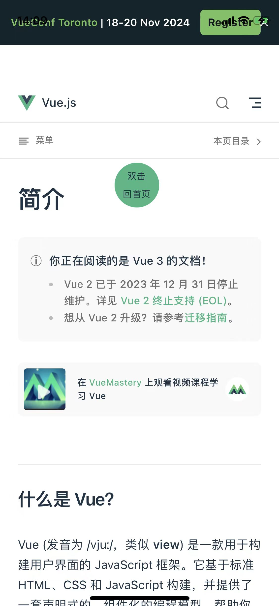

# vue 全家桶文档

在我们使用 vue 开发前端项目过程中，查阅文档是必不可少的过程。为了方便查阅，我将 vue 相关核心文档整理在一起。

## 本地启动 vue 全家桶文档

> 所有内容位于 docs 目录中  
> 该目录包含 vue/vuex/vue-router/pinia 文档

```bash
$ npx http-server docs

$ npm start # localhost:8080
```

## 本地启动操作手册

> 所有内容位于 notes 目录中  
> 此目录记录了 vue 全家桶文档项目的完整操作过程

```bash
$ npm run dev # localhost:5173
```

## APP 效果

### Android 端效果


### iOS 端效果




## 注意事项

### APP 下载

Android 可通过 release 下载 apk 文件

iOS 端，敬请期待。

### 离线文档返回首页的问题

为了方便在`离线文档`中返回到首页，我添加了一个`返回首页`按钮，在任意文档中，都可以看到一个`绿色圆形 双击回首页`的按钮，双击即可回到首页。

如图：


### iOS archive 时 Command PhaseScriptExecution failed with a nonzero exit code 错误

参考：https://github.com/ionic-team/capacitor/issues/6457

每次执行`npx cap sync`命令后，对于 iOS 项目，都需要做一些调整，避免在`archive`时报`Command PhaseScriptExecution failed with a nonzero exit code`错误。

未修改之前：

```
  if [ -L "${source}" ]; then
    echo "Symlinked..."
    source="$(readlink "${source}")"
  fi
```

修改之后：

```
  if [ -L "${source}" ]; then
    echo "Symlinked..."
    source="$(readlink -f "${source}")"
  fi
```

如下图：


## 相关链接

- [vuejs](https://cn.vuejs.org/)
- [vue-router](https://router.vuejs.org/zh/)
- [pinia](https://pinia.vuejs.org/zh/)
- [vuex](https://vuex.vuejs.org/zh/)
- [capacitor](https://capacitorjs.com/)
- [vitepress](https://vitepress.dev/zh/)
