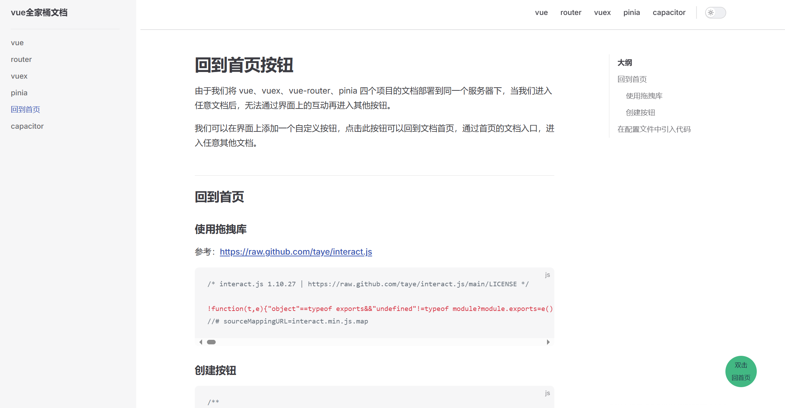
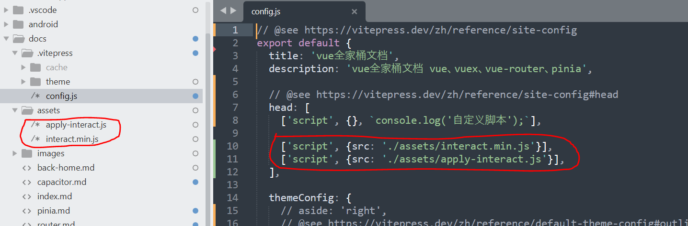

# 回到首页按钮

由于我们将 vue、vuex、vue-router、pinia 四个项目的文档部署到同一个服务器下，当我们进入任意文档后，无法通过界面上的互动再进入其他按钮。

我们可以在界面上添加一个自定义按钮，点击此按钮可以回到文档首页，通过首页的文档入口，进入任意其他文档。

下方图片中右下角蓝色圆点即为添加的按钮。



回到首页

## 回到首页

### 使用拖拽库

> docs/assets/interact.min.js

源仓库：https://github.com/taye/interact.js

参考文档：https://raw.github.com/taye/interact.js

代码来源：https://cdn.jsdelivr.net/npm/interactjs/dist/interact.min.js

### 创建按钮

> docs/assets/apply-interact.js

```js
// 检测是否为iOS设备
var isIOS = /iPad|iPhone|iPod/.test(navigator.userAgent) && !window.MSStream

function initIdValue() {
  const id = (Math.random() * 10000) | 0

  return 't' + id
}

const id_value = initIdValue()

function initElement() {
  const ele = document.createElement('div')

  const style_def = `
      width: 60px;
      height: 60px;
      position: fixed;
      z-index:1000;
      right: 100px;
      bottom:100px;
      border-radius:50%;
      background-color: rgba(66, 184, 131, 1);
      color: #213547;
      touch-action: none;
      user-select: none;
      display: flex;
      flex-direction: column;
      justify-content: center;
      align-items: center;
      font-size: 12px;
    `

  const id = (Math.random() * 10000) | 0

  ele.setAttribute('style', style_def)
  ele.setAttribute('id', id_value)
  ele.innerHTML = `<span>双击</span><span>回首页</span>`

  return ele
}

function triggerDblClick(target, fn) {
  // // 检测是否为iOS设备
  // var isIOS = /iPad|iPhone|iPod/.test(navigator.userAgent) && !window.MSStream;

  if (isIOS) {
    // 为了确保能够捕捉到双击事件，我们使用touch事件来模拟
    var touchstart = 0
    let touch_count = 0
    target.addEventListener(
      'touchstart',
      function (event) {
        if (touch_count === 0) {
          touch_count = touch_count + 1
          touchstart = Date.now()

          setTimeout(() => {
            touch_count = 0
          }, 300)
        } else if (touch_count === 1) {
          const cur = Date.now()

          if (cur - touchstart <= 300) {
            // 满足触发条件
            fn(event)
          }

          touch_count = 0
          touchstart = cur
        }
      },
      false
    )
  } else {
    // 非iOS设备可以直接监听dblclick事件
    target.addEventListener('dblclick', fn, false)
  }
}

function dealFixedIssue() {
  if (isIOS) {
    setTimeout(() => {
      const result = document.body.getBoundingClientRect()
      console.log(result)
    })
  }
}
dealFixedIssue()

const ele = initElement()

triggerDblClick(ele, function () {
  window.location.href = '/'
})

setTimeout(() => {
  document.body.appendChild(ele)

  const position = { x: 0, y: 0 }

  interact('#' + id_value).draggable({
    listeners: {
      start(event) {
        console.log(event.type, event.target)
      },
      move(event) {
        position.x += event.dx
        position.y += event.dy

        event.target.style.transform = `translate(${position.x}px, ${position.y}px)`
      },
    },
  })
}, 1000)
```

## 在配置文件中引入代码

```js
  // @see https://vitepress.dev/zh/reference/site-config#head
  head: [
    ['script', {}, `console.log('自定义脚本');`],

    ['script', {src: './assets/interact.min.js'}],
    ['script', {src: './assets/apply-interact.js'}],
  ],
```


