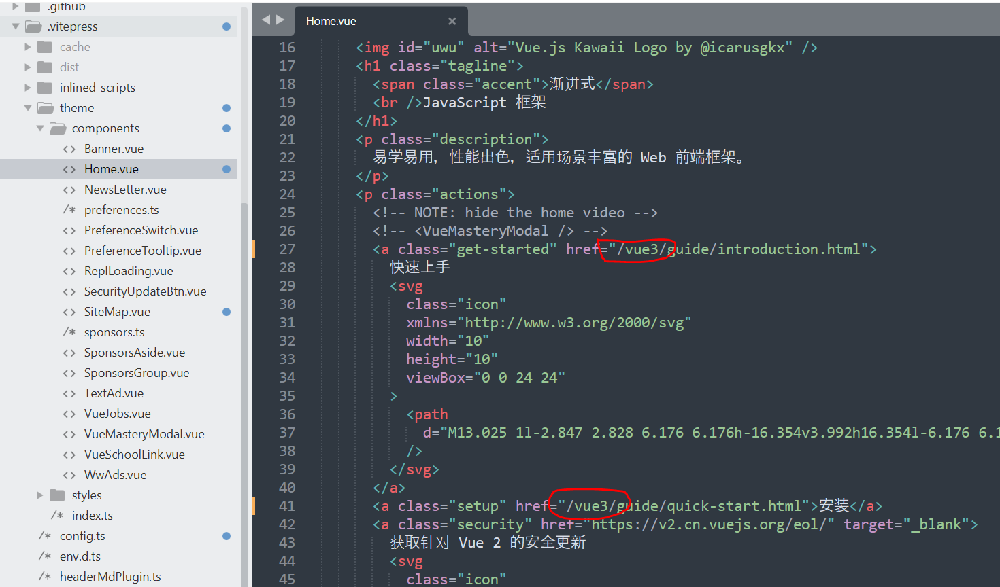

# vue文档本地化

## 相关链接

* 中文文档地址 https://cn.vuejs.org/
* 中文文档源码 https://github.com/vuejs-translations/docs-zh-cn
* 英文文档地址 https://vuejs.org/
* 英文文档源码 https://github.com/vuejs/docs

## 将vue文档源码下载到本地

> 此处使用中文文档

```bash
$ git clone https://github.com/vuejs-translations/docs-zh-cn.git

$ cd docs-zh-cn

# 直接执行npm install可能会失败
# 此项目限定了需要使用pnpm工具
# 如果没有安装，则会报错
# 解决办法1：npm install -g pnpm，然后再执行命令
# 解决办法2：删除package.json中script域中的preinstall行，然后执行命令
$ npm install

# 本地启动项目
$ npm run dev # localhost:5173
# 在浏览器中打开 localhost:5173 即可查看文档内容
```

**解决无法使用npm的问题**

> 打开`package.json`，删除`"preinstall": "npx only-allow pnpm",`

## 项目个性化修改

如果将项目部署到服务器的`根目录`，则无需做任何修改。可跳过`项目个性化修改`部分。

由于需要将vue文档部署到本地服务器的`二级目录`，或者自己的远程服务器`二级目录`。

对于项目中的某些地方，需要进行修改。

我们假设将文档项目部署到服务器的根目录下的`vue3`目录下。

### 修改文档的配置文件

> 配置文件位于：`/.vitepress/config.ts`

由于是将项目部署到服务器的二级目录，需要修改配置项`base`，参考：https://vitepress.dev/zh/reference/site-config#base

修改后的配置文件示例：

```js
export default defineConfigWithTheme<ThemeConfig>({
  base: '/vue3/',
}
```

修改后，文档部署后，可以通过类似`loaclhost:8080/vue3/`的形式进行访问。


### 修改首页的链接



### 修改文档的footer链接

在文档的首页底部，有许多相关的链接，有的指向文档本身，有的指向外部链接。由于此处并非有配置文件进行配置，而是由`SiteMap.vue`文件处理，故此处需要对`base`进行设置。

否则在点击底部链接时，就会出现链接失效的情况。

> 此文件位于 `/.vitepress/theme/components/SiteMap.vue`  

```js
import { VTLink } from '@vue/theme'
import { useData } from 'vitepress'

const data = useData()
const nav = data.site.value.themeConfig.nav
const base_conf = data.site.value.base;
const base_value = base_conf ? base_conf : '';
const ecosystem = nav.find((i: any) => i.activeMatch?.includes('ecosystem'))
const items = nav
  .filter((i: any) => i !== ecosystem && i.items)
  .concat(ecosystem.items)

const formatLink = (value) => {
  if(value.indexOf('http') === 0){
    return value;
  }else{
    return `${base_value.substring(0, base_value.length - 1)}${value}`;
  }
}
```

**修改后的截图**


### 修改文档的顶部导航 tutorial

在文档顶部的`tutorial`链接处，有一个重定向。

由于我们修改了`base`，为了防止重定向后找不到内容，此处也需要做处理。

> 此文件位于`/src/tutorial/TutorialRepl.vue`

```js
function updateExample(scroll = false) {
  let hash = location.hash.slice(1)
  if (!data.hasOwnProperty(hash)) {
    hash = 'step-1'
    location.replace(`/vue3/tutorial/#${hash}`)
  }
  currentStep.value = hash

  const content = showingHint.value ? data[hash]._hint! : data[hash]

  store.setFiles(
    preferSFC.value
      ? resolveSFCExample(content, preferComposition.value)
      : resolveNoBuildExample(content, preferComposition.value),
    preferSFC.value ? 'App.vue' : 'index.html'
  )

  if (scroll) {
    nextTick(() => {
      instruction.value!.scrollTop = 0
    })
  }
}
```

**修改后截图**


## 构建文档项目

在部署之前，需要构建文档项目。参考：https://vitepress.dev/zh/reference/cli#vitepress-build

```bash
$ npm run build
```

执行完`npm run build`命令后，即可在`/.vitepress/dist/`中找到所有的文档文件。我们可以通过`sftp`、`scp`等命令，或者`FileZilla`软件，将这些文件拷贝到服务器`根目录`的`vue3`目录下，然后即可通过`http://xxx.xxx.xxx/vue3/`进行访问。

文档部署，可参考：https://vitepress.dev/zh/guide/deploy