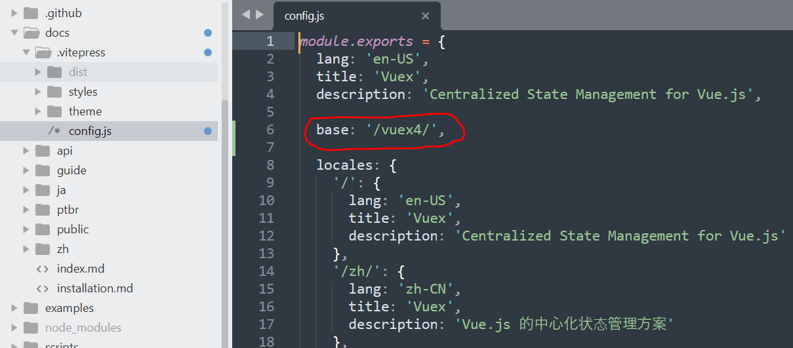

# vuex

## 相关链接

- [vuex 官方文档](https://vuex.vuejs.org/)
- [vuex github](https://github.com/vuejs/vuex)

## 将 vuex 文档下载到本地

```bash
$ git clone https://github.com/vuejs/vuex.git

$ cd vuex

$ npm install
```

## 修改配置文件

由于是将项目部署到服务器的二级目录，需要修改配置项`base`，参考：https://vitepress.dev/zh/reference/site-config#base

我们假设将文档项目部署到服务器的`根目录`下的`vuex4`目录下。

配置文件位于：`/docs/.vitepress/config.js`



## 构建项目

```bash
$ npm run docs:build
```

构建完成后，可在`/docs/.vitepress/dist`目录中查看所有的构建结果。我们将构建结果部署到服务器`根目录`的`vuex4`目录下，即可进行访问。

文档部署，可参考：https://vitepress.dev/zh/guide/deploy

<!--
# 错误：npm install

```
$ npm install
npm error code ERESOLVE
npm error ERESOLVE unable to resolve dependency tree
npm error
npm error While resolving: vuex@4.1.0
npm error Found: eslint@7.32.0
npm error node_modules/eslint
npm error   dev eslint@"^7.32.0" from the root project
npm error
npm error Could not resolve dependency:
npm error peer eslint@"^5.11.1 || ^6.0.0" from eslint-plugin-vue-libs@4.0.0
npm error node_modules/eslint-plugin-vue-libs
npm error   dev eslint-plugin-vue-libs@"^4.0.0" from the root project
npm error
npm error Fix the upstream dependency conflict, or retry
npm error this command with --force or --legacy-peer-deps
npm error to accept an incorrect (and potentially broken) dependency resolution.
npm error
npm error
npm error For a full report see:
npm error C:\Users\10515\AppData\Local\npm-cache\_logs\2024-10-10T06_50_34_258Z-eresolve-report.txt
npm error A complete log of this run can be found in: C:\Users\10515\AppData\Local\npm-cache\_logs\2024-10-10T06_50_34_258Z-debug-0.log
```

解决：

```bash
# 使用命令yarn
$ yarn

# 或者
$ npm install --legacy-peer-deps
```
-->

---

## 升级 vitepress 版本

在构建 APP 的过程中，发现`vuex`在 iOS 端的显示效果与其他文档显示不一致，且有明显的问题，主要表现在顶部导航栏在手机端显示异常，查看代码发现`.nav-bar`是通过`position:fixed;`定位的方式显示在顶端。于是决定升级`vitepress`版本来解决此问题。

### 调整 package.json 文件中的版本

调整之前: `"vitepress": "^0.20.0",`

调整之后：`"vitepress": "1.2.3",`

调整完成后，需要执行：`pnpm install`重新安装依赖项。

### 配置文件修改之前

```js
module.exports = {
  lang: 'en-US',
  title: 'Vuex',
  description: 'Centralized State Management for Vue.js',

  base: '/vuex4/',

  locales: {
    '/': {
      lang: 'en-US',
      title: 'Vuex',
      description: 'Centralized State Management for Vue.js',
    },
    '/zh/': {
      lang: 'zh-CN',
      title: 'Vuex',
      description: 'Vue.js 的中心化状态管理方案',
    },
    '/ja/': {
      lang: 'ja',
      title: 'Vuex',
      description: 'Vue.js のための集中状態管理',
    },
    '/ptbr/': {
      lang: 'pt-BR',
      title: 'Vuex',
      description: 'Gerenciamento de Estado Centralizado para Vue.js',
    },
  },

  head: [
    ['link', { rel: 'icon', href: `/logo.png` }],
    [
      'link',
      { rel: 'apple-touch-icon', href: `/icons/apple-touch-icon-152x152.png` },
    ],
    [
      'link',
      {
        rel: 'mask-icon',
        href: '/icons/safari-pinned-tab.svg',
        color: '#3eaf7c',
      },
    ],
    [
      'meta',
      {
        name: 'msapplication-TileImage',
        content: '/icons/msapplication-icon-144x144.png',
      },
    ],

    ['script', { src: '/libs/interact.min.js' }],
    ['script', { src: '/libs/apply-interact.js' }],
    // 禁止页面缩放
    [
      'meta',
      {
        name: 'viewport',
        content:
          'width=device-width, initial-scale=1, viewport-fit=cover, user-scalable=no, minimum-scale=1,maximum-scale=1',
      },
    ],
    // 刘海屏适配
    ['meta', { name: 'apple-mobile-web-app-capable', content: 'yes' }],
    [
      'meta',
      {
        name: 'apple-mobile-web-app-status-bar-style',
        content: 'black-translucent',
      },
    ],
    [
      'style',
      {},
      `html {
    padding: constant(safe-area-inset-top) constant(safe-area-inset-right)
      constant(safe-area-inset-bottom) constant(safe-area-inset-left) !important; /* 兼容 iOS < 11.2 */
    padding: env(safe-area-inset-top) env(safe-area-inset-right) env(
        safe-area-inset-bottom
      ) env(safe-area-inset-left) !important; /* 兼容 iOS >= 11.2 */
    }`,
    ],
    [
      'script',
      {},
      `function setStatusBar() {
      const StatusBar = window.Capacitor.Plugins.StatusBar

      // iOS only
      window.addEventListener('statusTap', function () {
        console.log('statusbar tapped')
      })

      // Display content under transparent status bar (Android only)
      StatusBar.setOverlaysWebView({ overlay: true })

      const showStatusBar = async () => {
        await StatusBar.show()
      }

      showStatusBar()
    }
    setStatusBar()`,
    ],
  ],

  themeConfig: {
    repo: 'vuejs/vuex',
    docsDir: 'docs',
    docsBranch: 'main',

    editLinks: true,

    locales: {
      '/': {
        label: 'English',
        selectText: 'Languages',
        editLinkText: 'Edit this page on GitHub',
        lastUpdated: 'Last Updated',

        nav: [
          { text: 'Guide', link: '/guide/' },
          { text: 'API Reference', link: '/api/' },
          {
            text: 'Release Notes',
            link: 'https://github.com/vuejs/vuex/releases',
          },
          {
            text: 'v4.x',
            items: [{ text: 'v3.x', link: 'https://v3.vuex.vuejs.org/' }],
          },
        ],

        sidebar: [
          {
            text: 'Introduction',
            children: [
              { text: 'What is Vuex?', link: '/' },
              { text: 'Installation', link: '/installation' },
              { text: 'Getting Started', link: '/guide/' },
            ],
          },
          {
            text: 'Core Concepts',
            children: [
              { text: 'State', link: '/guide/state' },
              { text: 'Getters', link: '/guide/getters' },
              { text: 'Mutations', link: '/guide/mutations' },
              { text: 'Actions', link: '/guide/actions' },
              { text: 'Modules', link: '/guide/modules' },
            ],
          },
          {
            text: 'Advanced',
            children: [
              { text: 'Application Structure', link: '/guide/structure' },
              { text: 'Composition API', link: '/guide/composition-api' },
              { text: 'Plugins', link: '/guide/plugins' },
              { text: 'Strict Mode', link: '/guide/strict' },
              { text: 'Form Handling', link: '/guide/forms' },
              { text: 'Testing', link: '/guide/testing' },
              { text: 'Hot Reloading', link: '/guide/hot-reload' },
              { text: 'TypeScript Support', link: '/guide/typescript-support' },
            ],
          },
          {
            text: 'Migration Guide',
            children: [
              {
                text: 'Migrating to 4.0 from 3.x',
                link: '/guide/migrating-to-4-0-from-3-x',
              },
            ],
          },
        ],
      },

      '/zh/': {
        label: '简体中文',
        selectText: '选择语言',
        editLinkText: '在 GitHub 上编辑此页',
        lastUpdated: '最近更新时间',

        nav: [
          { text: '指南', link: '/zh/guide/' },
          { text: 'API 参考', link: '/zh/api/' },
          { text: '更新记录', link: 'https://github.com/vuejs/vuex/releases' },
          {
            text: 'v4.x',
            items: [{ text: 'v3.x', link: 'https://v3.vuex.vuejs.org/zh' }],
          },
        ],

        sidebar: [
          {
            text: '介绍',
            children: [
              { text: 'Vuex 是什么?', link: '/zh/' },
              { text: '安装', link: '/zh/installation' },
              { text: '开始', link: '/zh/guide/' },
            ],
          },
          {
            text: '核心概念',
            children: [
              { text: 'State', link: '/zh/guide/state' },
              { text: 'Getter', link: '/zh/guide/getters' },
              { text: 'Mutation', link: '/zh/guide/mutations' },
              { text: 'Action', link: '/zh/guide/actions' },
              { text: 'Module', link: '/zh/guide/modules' },
            ],
          },
          {
            text: '进阶',
            children: [
              { text: '项目结构', link: '/zh/guide/structure' },
              { text: '组合式 API', link: '/zh/guide/composition-api' },
              { text: '插件', link: '/zh/guide/plugins' },
              { text: '严格模式', link: '/zh/guide/strict' },
              { text: '表单处理', link: '/zh/guide/forms' },
              { text: '测试', link: '/zh/guide/testing' },
              { text: '热重载', link: '/zh/guide/hot-reload' },
              { text: 'TypeScript 支持', link: '/zh/guide/typescript-support' },
            ],
          },
          {
            text: '迁移指南',
            children: [
              {
                text: '从 3.x 迁移到 4.0',
                link: '/zh/guide/migrating-to-4-0-from-3-x',
              },
            ],
          },
        ],
      },

      '/ja/': {
        label: '日本語',
        selectText: '言語',
        editLinkText: 'GitHub 上でこのページを編集する',
        lastUpdated: '最終更新日時',

        nav: [
          { text: 'ガイド', link: '/ja/guide/' },
          { text: 'API リファレンス', link: '/ja/api/' },
          {
            text: 'リリースノート',
            link: 'https://github.com/vuejs/vuex/releases',
          },
          {
            text: 'v4.x',
            items: [{ text: 'v3.x', link: 'https://v3.vuex.vuejs.org/ja' }],
          },
        ],

        sidebar: [
          {
            text: 'はじめに',
            children: [
              { text: 'Vuex とは何か？', link: '/ja/' },
              { text: 'インストール', link: '/ja/installation' },
              { text: 'Vuex 入門', link: '/ja/guide/' },
            ],
          },
          {
            text: 'コアコンセプト',
            children: [
              { text: 'ステート', link: '/ja/guide/state' },
              { text: 'ゲッター', link: '/ja/guide/getters' },
              { text: 'ミューテーション', link: '/ja/guide/mutations' },
              { text: 'アクション', link: '/ja/guide/actions' },
              { text: 'モジュール', link: '/ja/guide/modules' },
            ],
          },
          {
            text: '高度な活用',
            children: [
              { text: 'アプリケーションの構造', link: '/ja/guide/structure' },
              { text: 'Composition API', link: '/ja/guide/composition-api' },
              { text: 'プラグイン', link: '/ja/guide/plugins' },
              { text: '厳格モード', link: '/ja/guide/strict' },
              { text: 'フォームの扱い', link: '/ja/guide/forms' },
              { text: 'テスト', link: '/ja/guide/testing' },
              { text: 'ホットリローディング', link: '/ja/guide/hot-reload' },
              {
                text: 'TypeScript サポート',
                link: '/ja/guide/typescript-support',
              },
            ],
          },
          {
            text: '移行 ガイド',
            children: [
              {
                text: '3.x から 4.0 への移行',
                link: '/ja/guide/migrating-to-4-0-from-3-x',
              },
            ],
          },
        ],
      },

      '/ptbr/': {
        label: 'Português',
        selectText: 'Idiomas',
        editLinkText: 'Edite esta página no GitHub',
        lastUpdated: 'Última Atualização',

        nav: [
          { text: 'Guia', link: '/ptbr/guide/' },
          { text: 'Referência da API', link: '/ptbr/api/' },
          {
            text: 'Notas de Lançamento',
            link: 'https://github.com/vuejs/vuex/releases',
          },
          {
            text: 'v4.x',
            items: [{ text: 'v3.x', link: 'https://v3.vuex.vuejs.org/ptbr/' }],
          },
        ],

        sidebar: [
          {
            text: 'Introdução',
            children: [
              { text: 'O que é Vuex?', link: '/ptbr/' },
              { text: 'Instalação', link: '/ptbr/installation' },
              { text: 'Começando', link: '/ptbr/guide/' },
            ],
          },
          {
            text: 'Conceitos Básicos',
            children: [
              { text: 'Estado', link: '/ptbr/guide/state' },
              { text: 'Getters', link: '/ptbr/guide/getters' },
              { text: 'Mutações', link: '/ptbr/guide/mutations' },
              { text: 'Ações', link: '/ptbr/guide/actions' },
              { text: 'Módulos', link: '/ptbr/guide/modules' },
            ],
          },
          {
            text: 'Avançado',
            children: [
              { text: 'Estrutura da Aplicação', link: '/ptbr/guide/structure' },
              { text: 'Composition API', link: '/ptbr/guide/composition-api' },
              { text: 'Plugins', link: '/ptbr/guide/plugins' },
              { text: 'Modo Strict', link: '/ptbr/guide/strict' },
              { text: 'Manipulação de Formulários', link: '/ptbr/guide/forms' },
              { text: 'Testando', link: '/ptbr/guide/testing' },
              { text: 'Hot Reloading', link: '/ptbr/guide/hot-reload' },
              {
                text: 'Suporte ao TypeScript',
                link: '/ptbr/guide/typescript-support',
              },
            ],
          },
          {
            text: 'Guia de Migração',
            children: [
              {
                text: 'Migrando do 3.x para 4.0',
                link: '/ptbr/guide/migrating-to-4-0-from-3-x',
              },
            ],
          },
        ],
      },
    },
  },
}
```

### 配置文件修改之后

```js
const root_config = {
  themeConfig: {
    nav: [
      { text: 'Guide', link: '/guide/' },
      { text: 'API Reference', link: '/api/' },
      { text: 'Release Notes', link: 'https://github.com/vuejs/vuex/releases' },
      {
        text: 'v4.x',
        items: [{ text: 'v3.x', link: 'https://v3.vuex.vuejs.org/' }],
      },
    ],
    sidebar: {
      '/': [
        {
          text: 'Introduction',
          items: [
            { text: 'What is Vuex?', link: '/' },
            { text: 'Installation', link: '/installation' },
            { text: 'Getting Started', link: '/guide/' },
          ],
        },
        {
          text: 'Core Concepts',
          items: [
            { text: 'State', link: '/guide/state' },
            { text: 'Getters', link: '/guide/getters' },
            { text: 'Mutations', link: '/guide/mutations' },
            { text: 'Actions', link: '/guide/actions' },
            { text: 'Modules', link: '/guide/modules' },
          ],
        },
        {
          text: 'Advanced',
          items: [
            { text: 'Application Structure', link: '/guide/structure' },
            { text: 'Composition API', link: '/guide/composition-api' },
            { text: 'Plugins', link: '/guide/plugins' },
            { text: 'Strict Mode', link: '/guide/strict' },
            { text: 'Form Handling', link: '/guide/forms' },
            { text: 'Testing', link: '/guide/testing' },
            { text: 'Hot Reloading', link: '/guide/hot-reload' },
            { text: 'TypeScript Support', link: '/guide/typescript-support' },
          ],
        },
        {
          text: 'Migration Guide',
          items: [
            {
              text: 'Migrating to 4.0 from 3.x',
              link: '/guide/migrating-to-4-0-from-3-x',
            },
          ],
        },
      ],
    },
  },
}

const zh_config = {
  themeConfig: {
    nav: [
      { text: '指南', link: '/zh/guide/' },
      { text: 'API 参考', link: '/zh/api/' },
      { text: '更新记录', link: 'https://github.com/vuejs/vuex/releases' },
      {
        text: 'v4.x',
        items: [{ text: 'v3.x', link: 'https://v3.vuex.vuejs.org/zh' }],
      },
    ],
    sidebar: {
      '/zh/': [
        {
          text: '介绍',
          items: [
            { text: 'Vuex 是什么?', link: '/zh/' },
            { text: '安装', link: '/zh/installation' },
            { text: '开始', link: '/zh/guide/' },
          ],
        },
        {
          text: '核心概念',
          items: [
            { text: 'State', link: '/zh/guide/state' },
            { text: 'Getter', link: '/zh/guide/getters' },
            { text: 'Mutation', link: '/zh/guide/mutations' },
            { text: 'Action', link: '/zh/guide/actions' },
            { text: 'Module', link: '/zh/guide/modules' },
          ],
        },
        {
          text: '进阶',
          items: [
            { text: '项目结构', link: '/zh/guide/structure' },
            { text: '组合式 API', link: '/zh/guide/composition-api' },
            { text: '插件', link: '/zh/guide/plugins' },
            { text: '严格模式', link: '/zh/guide/strict' },
            { text: '表单处理', link: '/zh/guide/forms' },
            { text: '测试', link: '/zh/guide/testing' },
            { text: '热重载', link: '/zh/guide/hot-reload' },
            { text: 'TypeScript 支持', link: '/zh/guide/typescript-support' },
          ],
        },
        {
          text: '迁移指南',
          items: [
            {
              text: '从 3.x 迁移到 4.0',
              link: '/zh/guide/migrating-to-4-0-from-3-x',
            },
          ],
        },
      ],
    },
  },
}

const ja_config = {
  themeConfig: {
    nav: [
      { text: 'ガイド', link: '/ja/guide/' },
      { text: 'API リファレンス', link: '/ja/api/' },
      {
        text: 'リリースノート',
        link: 'https://github.com/vuejs/vuex/releases',
      },
      {
        text: 'v4.x',
        items: [{ text: 'v3.x', link: 'https://v3.vuex.vuejs.org/ja' }],
      },
    ],
    sidebar: {
      '/ja/': [
        {
          text: 'はじめに',
          items: [
            { text: 'Vuex とは何か？', link: '/ja/' },
            { text: 'インストール', link: '/ja/installation' },
            { text: 'Vuex 入門', link: '/ja/guide/' },
          ],
        },
        {
          text: 'コアコンセプト',
          items: [
            { text: 'ステート', link: '/ja/guide/state' },
            { text: 'ゲッター', link: '/ja/guide/getters' },
            { text: 'ミューテーション', link: '/ja/guide/mutations' },
            { text: 'アクション', link: '/ja/guide/actions' },
            { text: 'モジュール', link: '/ja/guide/modules' },
          ],
        },
        {
          text: '高度な活用',
          items: [
            { text: 'アプリケーションの構造', link: '/ja/guide/structure' },
            { text: 'Composition API', link: '/ja/guide/composition-api' },
            { text: 'プラグイン', link: '/ja/guide/plugins' },
            { text: '厳格モード', link: '/ja/guide/strict' },
            { text: 'フォームの扱い', link: '/ja/guide/forms' },
            { text: 'テスト', link: '/ja/guide/testing' },
            { text: 'ホットリローディング', link: '/ja/guide/hot-reload' },
            {
              text: 'TypeScript サポート',
              link: '/ja/guide/typescript-support',
            },
          ],
        },
        {
          text: '移行 ガイド',
          items: [
            {
              text: '3.x から 4.0 への移行',
              link: '/ja/guide/migrating-to-4-0-from-3-x',
            },
          ],
        },
      ],
    },
  },
}

const ptbr_config = {
  themeConfig: {
    nav: [
      { text: 'Guia', link: '/ptbr/guide/' },
      { text: 'Referência da API', link: '/ptbr/api/' },
      {
        text: 'Notas de Lançamento',
        link: 'https://github.com/vuejs/vuex/releases',
      },
      {
        text: 'v4.x',
        items: [{ text: 'v3.x', link: 'https://v3.vuex.vuejs.org/ptbr/' }],
      },
    ],
    sidebar: {
      '/ptbr/': [
        {
          text: 'Introdução',
          items: [
            { text: 'O que é Vuex?', link: '/ptbr/' },
            { text: 'Instalação', link: '/ptbr/installation' },
            { text: 'Começando', link: '/ptbr/guide/' },
          ],
        },
        {
          text: 'Conceitos Básicos',
          items: [
            { text: 'Estado', link: '/ptbr/guide/state' },
            { text: 'Getters', link: '/ptbr/guide/getters' },
            { text: 'Mutações', link: '/ptbr/guide/mutations' },
            { text: 'Ações', link: '/ptbr/guide/actions' },
            { text: 'Módulos', link: '/ptbr/guide/modules' },
          ],
        },
        {
          text: 'Avançado',
          items: [
            { text: 'Estrutura da Aplicação', link: '/ptbr/guide/structure' },
            { text: 'Composition API', link: '/ptbr/guide/composition-api' },
            { text: 'Plugins', link: '/ptbr/guide/plugins' },
            { text: 'Modo Strict', link: '/ptbr/guide/strict' },
            { text: 'Manipulação de Formulários', link: '/ptbr/guide/forms' },
            { text: 'Testando', link: '/ptbr/guide/testing' },
            { text: 'Hot Reloading', link: '/ptbr/guide/hot-reload' },
            {
              text: 'Suporte ao TypeScript',
              link: '/ptbr/guide/typescript-support',
            },
          ],
        },
        {
          text: 'Guia de Migração',
          items: [
            {
              text: 'Migrando do 3.x para 4.0',
              link: '/ptbr/guide/migrating-to-4-0-from-3-x',
            },
          ],
        },
      ],
    },
  },
}

export default {
  lang: 'en-US',
  title: 'Vuex',
  description: 'Centralized State Management for Vue.js',

  base: '/vuex4/',

  locales: {
    root: {
      lang: 'en-US',
      label: '英文',
      description: 'Centralized State Management for Vue.js',
      link: '/',
      ...root_config,
    },
    zh: {
      lang: 'zh-CN',
      label: '中文',
      description: 'Vue.js 的中心化状态管理方案',
      link: '/zh/',
      ...zh_config,
    },
    ja: {
      lang: 'ja',
      label: '日本语',
      description: 'Vue.js のための集中状態管理',
      link: '/ja/',
      ...ja_config,
    },
    ptbr: {
      lang: 'pt-BR',
      label: 'Português',
      description: 'Gerenciamento de Estado Centralizado para Vue.js',
      link: '/ptbr/',
      ...ptbr_config,
    },
  },

  head: [
    ['link', { rel: 'icon', href: `/logo.png` }],
    [
      'link',
      { rel: 'apple-touch-icon', href: `/icons/apple-touch-icon-152x152.png` },
    ],
    [
      'link',
      {
        rel: 'mask-icon',
        href: '/icons/safari-pinned-tab.svg',
        color: '#3eaf7c',
      },
    ],
    [
      'meta',
      {
        name: 'msapplication-TileImage',
        content: '/icons/msapplication-icon-144x144.png',
      },
    ],

    ['script', { src: '/libs/interact.min.js' }],
    ['script', { src: '/libs/apply-interact.js' }],
    // 禁止页面缩放
    [
      'meta',
      {
        name: 'viewport',
        content:
          'width=device-width, initial-scale=1, viewport-fit=cover, user-scalable=no, minimum-scale=1,maximum-scale=1',
      },
    ],
    // 刘海屏适配
    ['meta', { name: 'apple-mobile-web-app-capable', content: 'yes' }],
    [
      'meta',
      {
        name: 'apple-mobile-web-app-status-bar-style',
        content: 'black-translucent',
      },
    ],
    [
      'style',
      {},
      `html {
    padding: constant(safe-area-inset-top) constant(safe-area-inset-right)
      constant(safe-area-inset-bottom) constant(safe-area-inset-left) !important; /* 兼容 iOS < 11.2 */
    padding: env(safe-area-inset-top) env(safe-area-inset-right) env(
        safe-area-inset-bottom
      ) env(safe-area-inset-left) !important; /* 兼容 iOS >= 11.2 */
    }`,
    ],
    [
      'script',
      {},
      `function setStatusBar() {
      const StatusBar = window.Capacitor.Plugins.StatusBar

      // iOS only
      window.addEventListener('statusTap', function () {
        console.log('statusbar tapped')
      })

      // Display content under transparent status bar (Android only)
      StatusBar.setOverlaysWebView({ overlay: true })

      const showStatusBar = async () => {
        await StatusBar.show()
      }

      showStatusBar()
    }
    setStatusBar()`,
    ],
  ],

  themeConfig: {
    repo: 'vuejs/vuex',
    docsDir: 'docs',
    docsBranch: 'main',

    editLinks: true,
  },
}
```
