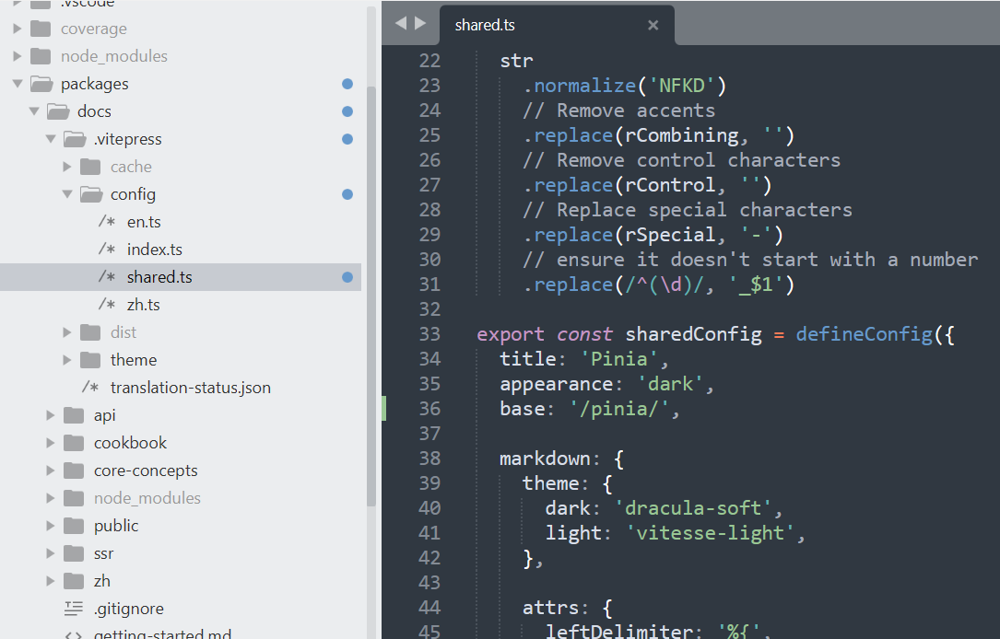

# pinia

## 相关链接

* [pinia 官方文档](https://pinia.vuejs.org/zh/)
* [pinia GitHub](https://github.com/vuejs/pinia)

## 将文档项目下载到本地

`pinia`包通过`monorepo`的方式进行组织，其`文档项目`位于`pinia`的核心包中。

```bash
$ https://github.com/vuejs/pinia.git

$ cd pinia

# 此包使用pnpm进行管理，如果机器上没有安装pnpm，则需要先安装pnpm
# pnpm主页： https://www.pnpm.cn/
# 安装项目依赖
$ pnpm install
```

## 项目个性化修改

我们将把此文档项目部署到服务器根目录的`pinia`目录下，故需要调整配置文件中的`base`字段。参考：https://vitepress.dev/zh/reference/site-config#base

如果将项目部署到根目录，则无需做此修改。

配置文件位于`/packages/docs/.vitepress/config/shared.ts`



## 构建项目

由于`pinia`的文档依赖`pinia`，故需要先构建`pinia`，然后才可以构建文档项目。

```bash
# 构建pinia
$ cd packages/pinia
$ pnpm run build

# 构建文档
$ cd packages/docs
$ pnpm run docs:build
```

构建完成后，可查看`packages/docs/.vitepress/dist`目录，所有构建好的文档文件都存在于此目录下。将此目录下的所有文件部署到服务器根目录下的`pinia`目录中，即可进行访问。

文档部署，可参考：https://vitepress.dev/zh/guide/deploy