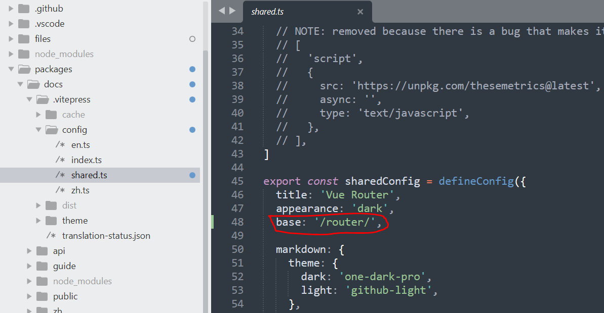

# vue router文档本地化

## 相关链接

* [router 官网](https://router.vuejs.org/)
* [router GitHub](https://github.com/vuejs/router)

## 将文档项目下载到本地

`vue-router`包通过`monorepo`的方式进行组织，其`文档项目`位于`vue-router`的核心包中。

```bash
$ git clone https://github.com/vuejs/router.git

$ cd router

# 此包使用pnpm进行管理，如果机器上没有安装pnpm，则需要先安装pnpm
# pnpm主页： https://www.pnpm.cn/
# 安装项目依赖
$ pnpm install

# 安装过程中可能会出现chromedriver下载的问题
# 可参考下方进行解决
```

## 项目个性化修改

我们将把此文档项目部署到服务器根目录的`router`目录下，故需要调整配置文件中的`base`字段。参考：https://vitepress.dev/zh/reference/site-config#base

如果将项目部署到根目录，则无需做此修改。

配置文件位于`/packages/docs/.vitepress/config/shared.ts`



## 构建项目

```bash
$ cd packages/docs

$ pnpm run docs:build
```

构建完成后，可查看`packages/docs/.vitepress/dist`目录，所有构建好的文档文件都存在于此目录下。将此目录下的所有文件部署到服务器根目录下的`router`目录中，即可进行访问。

文档部署，可参考：https://vitepress.dev/zh/guide/deploy

## 解决问题

### 解决chromedriver下载的问题

> 参考NPM上的说明，配置项目下的.npmrc文件可解决此问题

* [chromedriver 官网说明](https://developer.chrome.com/docs/chromedriver?hl=zh-cn)
* [chromedriver NPM](https://www.npmjs.com/package/chromedriver)

<!--

配置`.npmrc`

```
shamefully-hoist=true
detect_chromedriver_version=true
strict-peer-dependencies=false

# chromedriver_cdnurl=https://npmmirror.com/metadata
# chromedriver_cdnbinariesurl=https://npmmirror.com/binaries

chromedriver_cdnurl=http://192.168.0.104:8080
chromedriver_cdnbinariesurl=http://192.168.0.104:8080
```

> 使用powershell输出文件夹结构

```bash
$ tree /F
卷 勿动-代码 的文件夹 PATH 列表
卷序列号为 5663-5A66
E:.
├─129.0.6668.100
│  └─win64
│          chromedriver-win64.zip
│
└─chrome-for-testing
        latest-versions-per-milestone.json
```

查看自己电脑上安装的Chrome浏览器版本，
-->
